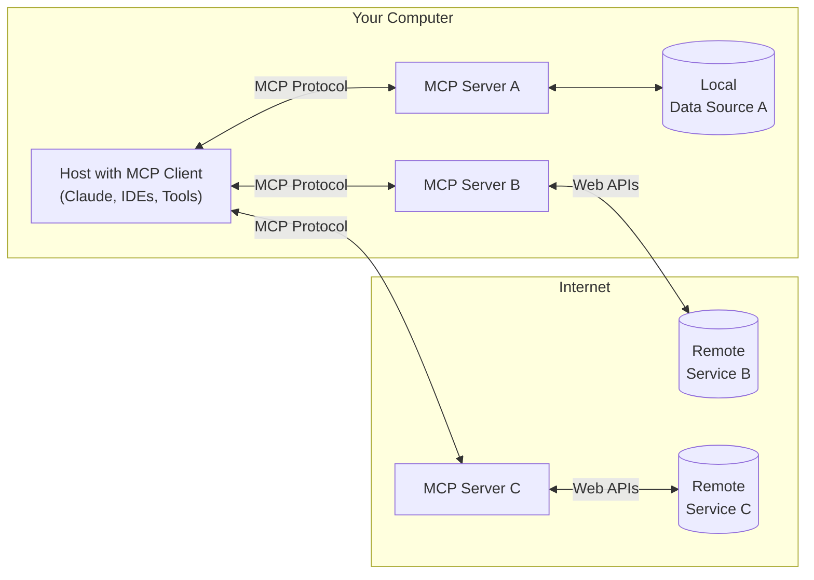

# Context for: modelcontextprotocol

## Directory Structure

```modelcontextprotocol/
├── docs
│   ├── community
│   │   ├── governance.mdx
│   │   └── sep-guidelines.mdx
│   ├── development
│   │   └── roadmap.mdx
│   ├── faqs.mdx
│   └── introduction.mdx
└── README.md
```
---

## File Contents

--- START OF FILE README.md ---
# Model Context Protocol specification

This repo contains the specification and protocol schema for the Model Context Protocol.

The schema is [defined in TypeScript](schema/2025-06-18/schema.ts) first, but
[made available as JSON Schema](schema/2025-06-18/schema.json) as well, for wider
compatibility.

The official MCP documentation is built using Mintlify and available at
[modelcontextprotocol.io](https://modelcontextprotocol.io).

## Contributing

Please see [CONTRIBUTING.md](CONTRIBUTING.md) for details on how to contribute to this
project.

## License

This project is licensed under the MIT License—see the [LICENSE](LICENSE) file for
details.
--- END OF FILE README.md ---


--- START OF FILE docs/faqs.mdx ---
---
title: "FAQs"
description: "Explaining MCP and why it matters in simple terms"
---

## What is MCP?

MCP (Model Context Protocol) is a standard way for AI applications and agents to connect to and work with your data sources (e.g. local files, databases, or content repositories) and tools (e.g. GitHub, Google Maps, or Puppeteer).

Think of MCP as a universal adapter for AI applications, similar to what USB-C is for physical devices. USB-C acts as a universal adapter to connect devices to various peripherals and accessories. Similarly, MCP provides a standardized way to connect AI applications to different data and tools.

Before USB-C, you needed different cables for different connections. Similarly, before MCP, developers had to build custom connections to each data source or tool they wanted their AI application to work with—a time-consuming process that often resulted in limited functionality. Now, with MCP, developers can easily add connections to their AI applications, making their applications much more powerful from day one.

## Why does MCP matter?

### For AI application users

MCP means your AI applications can access the information and tools you work with every day, making them much more helpful. Rather than AI being limited to what it already knows about, it can now understand your specific documents, data, and work context.

For example, by using MCP servers, applications can access your personal documents from Google Drive or data about your codebase from GitHub, providing more personalized and contextually relevant assistance.

Imagine asking an AI assistant: "Summarize last week's team meeting notes and schedule follow-ups with everyone."

By using connections to data sources powered by MCP, the AI assistant can:

- Connect to your Google Drive through an MCP server to read meeting notes
- Understand who needs follow-ups based on the notes
- Connect to your calendar through another MCP server to schedule the meetings automatically

### For developers

MCP reduces development time and complexity when building AI applications that need to access various data sources. With MCP, developers can focus on building great AI experiences rather than repeatedly creating custom connectors.

Traditionally, connecting applications with data sources required building custom, one-off connections for each data source and each application. This created significant duplicative work—every developer wanting to connect their AI application to Google Drive or Slack needed to build their own connection.

MCP simplifies this by enabling developers to build MCP servers for data sources that are then reusable by various applications. For example, using the open source Google Drive MCP server, many different applications can access data from Google Drive without each developer needing to build a custom connection.

This open source ecosystem of MCP servers means developers can leverage existing work rather than starting from scratch, making it easier to build powerful AI applications that seamlessly integrate with the tools and data sources their users already rely on.

## How does MCP work?

<Frame>
  
</Frame>

MCP creates a bridge between your AI applications and your data through a straightforward system:

- **MCP servers** connect to your data sources and tools (like Google Drive or Slack)
- **MCP clients** are run by AI applications (like Claude Desktop) to connect them to these servers
- When you give permission, your AI application discovers available MCP servers
- The AI model can then use these connections to read information and take actions

This modular system means new capabilities can be added without changing AI applications themselves—just like adding new accessories to your computer without upgrading your entire system.

## Who creates and maintains MCP servers?

MCP servers are developed and maintained by:

- Developers at Anthropic who build servers for common tools and data sources
- Open source contributors who create servers for tools they use
- Enterprise development teams building servers for their internal systems
- Software providers making their applications AI-ready

Once an open source MCP server is created for a data source, it can be used by any MCP-compatible AI application, creating a growing ecosystem of connections. See our [list of example servers](/examples), or [get started building your own server](/quickstart/server).
--- END OF FILE docs/faqs.mdx ---


--- START OF FILE docs/introduction.mdx ---
---
title: Introduction
description: "Get started with the Model Context Protocol (MCP)"
---

MCP is an open protocol that standardizes how applications provide context to LLMs. Think of MCP like a USB-C port for AI applications. Just as USB-C provides a standardized way to connect your devices to various peripherals and accessories, MCP provides a standardized way to connect AI models to different data sources and tools.

## Why MCP?

MCP helps you build agents and complex workflows on top of LLMs. LLMs frequently need to integrate with data and tools, and MCP provides:

- A growing list of pre-built integrations that your LLM can directly plug into
- The flexibility to switch between LLM providers and vendors
- Best practices for securing your data within your infrastructure

### General architecture

At its core, MCP follows a client-server architecture where a host application can connect to multiple servers:



- **MCP Hosts**: Programs like Claude Desktop, IDEs, or AI tools that want to access data through MCP
- **MCP Clients**: Protocol clients that maintain 1:1 connections with servers
- **MCP Servers**: Lightweight programs that each expose specific capabilities through the standardized Model Context Protocol
- **Local Data Sources**: Your computer's files, databases, and services that MCP servers can securely access
- **Remote Services**: External systems available over the internet (e.g., through APIs) that MCP servers can connect to

## Get started

Choose the path that best fits your needs:

### Quick Starts

<CardGroup cols={2}>
  <Card title="For Server Developers" icon="bolt" href="/quickstart/server">
    Get started building your own server to use in Claude for Desktop and other
    clients
  </Card>
  <Card title="For Client Developers" icon="bolt" href="/quickstart/client">
    Get started building your own client that can integrate with all MCP servers
  </Card>
  <Card title="For Claude Desktop Users" icon="bolt" href="/quickstart/user">
    Get started using pre-built servers in Claude for Desktop
  </Card>
</CardGroup>

### Examples

<CardGroup cols={2}>
  <Card title="Example Servers" icon="grid" href="/examples">
    Check out our gallery of official MCP servers and implementations
  </Card>
  <Card title="Example Clients" icon="cubes" href="/clients">
    View the list of clients that support MCP integrations
  </Card>
</CardGroup>

## Tutorials

<CardGroup cols={2}>
  <Card
    title="Building MCP with LLMs"
    icon="comments"
    href="/tutorials/building-mcp-with-llms"
  >
    Learn how to use LLMs like Claude to speed up your MCP development
  </Card>
  <Card title="Debugging Guide" icon="bug" href="/docs/tools/debugging">
    Learn how to effectively debug MCP servers and integrations
  </Card>
  <Card
    title="MCP Inspector"
    icon="magnifying-glass"
    href="/docs/tools/inspector"
  >
    Test and inspect your MCP servers with our interactive debugging tool
  </Card>
  <Card
    title="MCP Workshop (Video, 2hr)"
    icon="person-chalkboard"
    href="https://www.youtube.com/watch?v=kQmXtrmQ5Zg"
  >
    <iframe src="https://www.youtube.com/embed/kQmXtrmQ5Zg"> </iframe>
  </Card>
</CardGroup>

## Explore MCP

Dive deeper into MCP's core concepts and capabilities:

<CardGroup cols={2}>
  <Card
    title="Core architecture"
    icon="sitemap"
    href="/docs/concepts/architecture"
  >
    Understand how MCP connects clients, servers, and LLMs
  </Card>
  <Card title="Resources" icon="database" href="/docs/concepts/resources">
    Expose data and content from your servers to LLMs
  </Card>
  <Card title="Prompts" icon="message" href="/docs/concepts/prompts">
    Create reusable prompt templates and workflows
  </Card>
  <Card title="Tools" icon="wrench" href="/docs/concepts/tools">
    Enable LLMs to perform actions through your server
  </Card>
  <Card title="Sampling" icon="robot" href="/docs/concepts/sampling">
    Let your servers request completions from LLMs
  </Card>
  <Card
    title="Transports"
    icon="network-wired"
    href="/docs/concepts/transports"
  >
    Learn about MCP's communication mechanism
  </Card>
</CardGroup>

## Contributing

Want to contribute? Check out our [Contributing Guide](/development/contributing) to learn how you can help improve MCP.

## Support and Feedback

Here's how to get help or provide feedback:

- For bug reports and feature requests related to the MCP specification, SDKs, or documentation (open source), please [create a GitHub issue](https://github.com/modelcontextprotocol)
- For discussions or Q&A about the MCP specification, use the [specification discussions](https://github.com/modelcontextprotocol/specification/discussions)
- For discussions or Q&A about other MCP open source components, use the [organization discussions](https://github.com/orgs/modelcontextprotocol/discussions)
- For bug reports, feature requests, and questions related to Claude.app and claude.ai's MCP integration, please see Anthropic's guide on [How to Get Support](https://support.anthropic.com/en/articles/9015913-how-to-get-support)
--- END OF FILE docs/introduction.mdx ---


--- START OF FILE docs/community/governance.mdx ---
---
title: Governance and Stewardship
description: Learn about the Model Context Protocol's governance structure and how to participate in the community
---

The Model Context Protocol (MCP) follows a formal governance model to ensure transparent decision-making and community participation. This document outlines how the project is organized and how decisions are made.

## Technical Governance

The MCP project adopts a hierarchical structure, similar to Python, PyTorch and other open source projects:

- A community of **contributors** who file issues, make pull requests, and contribute to the project.
- A small set of **maintainers** drive components within the MCP project, such as SDKs, documentation, and others.
- Contributors and maintainers are overseen by **core maintainers**, who drive the overall project direction.
- The core maintainers have two **lead core maintainers** who are the catch-all decision makers.
- Maintainers, core maintainers, and lead core maintainers form the **MCP steering group**.

All maintainers are expected to have a strong bias towards MCP's design philosophy. Membership in the technical governance process is for individuals, not companies. That is, there are no seats reserved for specific companies, and membership is associated with the person rather than the company employing that person. This ensures that maintainers act in the best interests of the protocol itself and the open source community.

### Channels

Technical Governance is facilitated through a shared Discord server of all **maintainers, core maintainers** and **lead maintainers**. Each maintainer group can choose additional communication channels, but all decisions and their supporting discussions must be recorded and made transparently available on the core group Discord server.

### Maintainers

Maintainers are responsible for individual projects or technical working groups within the MCP project. These generally are independent repositories such as language-specific SDKs, but can also extend to subdirectories of a repository, such as the MCP documentation. Maintainers may adopt their own rules and procedures for making decisions. Maintainers are expected to make decisions for their respective projects independently, but can defer or escalate to the core maintainers when needed.

Maintainers are responsible for the:

- Thoughtful and productive engagement with community contributors,
- Maintaining and improving their respective area of the MCP project,
- Supporting documentation, roadmaps and other adjacent parts of the MCP project,
- Present ideas from community to core.

Maintainers are encouraged to propose additional maintainers when needed. Maintainers can only be appointed and removed by core maintainers or lead core maintainers at any time and without reason.

Maintainers have write and/or admin access to their respective repositories.

### Core Maintainers

The core maintainers are expected to have a deep understanding of the Model Context Protocol and its specification. Their responsibilities include:

- Designing, reviewing and steering the evolution of the MCP specification, as well as all other parts of the MCP project, such as documentation,
- Articulating a cohesive long-term vision for the project,
- Mediating and resolving contentious issues with fairness and transparency, seeking consensus where possible while making decisive choices when necessary,
- Appoint or remove maintainers,
- Stewardship of the MCP project in the best interest of MCP.

The core maintainers as a group have the power to veto any decisions made by maintainers by majority vote. The core maintainers have power to resolve disputes as they see fit. The core maintainers should publicly articulate their decision-making. The core group is responsible for adopting their own procedures for making decisions.

Core maintainers generally have write and admin access to all MCP repositories, but should use the same contribution (usually pull-requests) mechanism as outside contributors. Exceptions can be made based on security considerations.

### Lead Maintainers (BDFL)

MCP has two lead maintainers: Justin Spahr-Summers and David Soria Parra. Lead Maintainers can veto any decision by core maintainers or maintainers. This model is also commonly known as Benevolent Dictator for Life (BDFL) in the open source community. The Lead Maintainers should publicly articulate their decision-making and give clear reasoning for their decisions. Lead maintainers are part of the core maintainer group.

The Lead Maintainers are responsible for confirming or removing core maintainers.

Lead Maintainers are administrators on all infrastructure for the MCP project where possible. This includes but is not restricted to all communication channels, GitHub organizations and repositories.

### Decision Process

The core maintainer group meets every two weeks to discuss and vote on proposals, as well as discuss any topics needed. The shared Discord server can be used to discuss and vote on smaller proposals if needed.

The lead maintainer, core maintainer, and maintainer group should attempt to meet in person every three to six months.

## Processes

Core and lead maintainers are responsible for all aspects of Model Context Protocol, including documentation, issues, suggestions for content, and all other parts under the [MCP project](https://github.com/modelcontextprotocol). Maintainers are responsible for documentation, issues, and suggestions of content for their area of the MCP project, but are encouraged to partake in general maintenance of the MCP projects. Maintainers, core maintainers, and lead maintainers should use the same contribution process as external contributors, rather than making direct changes to repos. This provides insight into intent and opportunity for discussion.

### Projects and Working Groups

The MCP project is organized into two main structures: projects and working groups.

Projects are concrete components maintained in dedicated repositories. These include the Specification, TypeScript SDK, Go SDK, Inspector, and other implementation artifacts.

Working groups are forums for collaboration where interested parties discuss specific aspects of MCP without maintaining code repositories. These include groups focused on transport protocols, client implementation, and other cross-cutting concerns.

#### Governance Principles

All projects and working groups are self-governed while adhering to these core principles:

1. Clear contribution and decision-making processes
2. Open communication and transparent decisions

Both must:

- Document their contribution process
- Maintain transparent communication
- Make decisions publicly (working groups must publish meeting notes and proposals)

Projects and working groups without specified processes default to:

- GitHub pull requests and issues for contributions
- A public channel in the official MCP Discord (TBD)

#### Maintenance Responsibilities

Components without dedicated maintainers (such as documentation) fall under core maintainer responsibility. These follow standard contribution guidelines through pull requests, with maintainers handling reviews and escalating to core maintainer review for any significant changes.

Core maintainers and maintainers are encouraged to improve any part of the MCP project, regardless of formal maintenance assignments.

### Specification Project

#### Specification Enhancement Proposal (SEP)

Proposed changes to the specification must come in the form of a written version, starting with a summary of the proposal, outlining the **problem** it tries to solve, propose **solution**, **alternatives**, **considerations, outcomes** and **risks**. The [SEP Guidelines](/community/sep-guidelines) outline information on the expected structure of SEPs. SEP's should be created as issues in the [specification repository](https://github.com/modelcontextprotocol/specification) and tagged with the labels `proposal, sep`.

All proposals must have a **sponsor** from the MCP steering group (maintainer, core maintainer or lead core maintainer). The sponsor is responsible for ensuring that the proposal is actively developed, meets the quality standard for proposals and is responsible for presenting and discussing it in meetings of core maintainers. Maintainer and Core Maintainer groups should review open proposals without sponsors in regular intervals. Proposals that do not find a sponsor within six months are automatically rejected.

Once proposals have a sponsor, they are assigned to the sponsor and are tagged `draft`.

## Communication

### Core Maintainer Meetings

The core maintainer group meets on a bi-weekly basis to discuss proposals and the project. Notes on proposals should be made public. The core maintainer group will strive to meet in person every 3-6 months.

### Public Chat

The MCP project maintains a public Discord server with open chats for interest groups. The MCP project may have private channels for certain communications.

## Nominating, Confirming and Removing Maintainers

### The Principles

- Membership in module maintainer groups is given to **individuals** on merit basis after they demonstrated strong expertise of their area of work through contributions, reviews, and discussions and are aligned with the overall MCP direction.
- For membership in the **maintainer** group the individual has to demonstrate strong and continued alignment with the overall MCP principles.
- No term limits for module maintainers or core maintainers
- Light criteria of moving working-group or sub-project maintenance to 'emeritus' status if they don't actively participate over long periods of time. Each maintainer group may define the inactive period that's appropriate for their area.
- The membership is for an individual, not a company.

### Nomination and Removal

- Core Maintainers are responsible for adding and removing maintainers. They will take the consideration of existing maintainers into account.
- The lead maintainers are responsible for adding and removing core maintainers.

## Current Core Maintainers

- Inna Harper
- Basil Hosmer
- Paul Carleton
- Nick Cooper
- Nick Aldridge
- Che Liu
- Den Delimarsky
--- END OF FILE docs/community/governance.mdx ---


--- START OF FILE docs/community/sep-guidelines.mdx ---
---
title: SEP Guidelines
description: Specification Enhancement Proposal (SEP) guidelines for proposing changes to the Model Context Protocol
---

## What is a SEP?

SEP stands for Specification Enhancement Proposal. A SEP is a design document providing information to the MCP community, or describing a new feature for the Model Context Protocol or its processes or environment. The SEP should provide a concise technical specification of the feature and a rationale for the feature.

We intend SEPs to be the primary mechanisms for proposing major new features, for collecting community input on an issue, and for documenting the design decisions that have gone into MCP. The SEP author is responsible for building consensus within the community and documenting dissenting opinions.

Because the SEPs are maintained as text files in a versioned repository (GitHub Issues), their revision history is the historical record of the feature proposal.

## What qualifies a SEP?

The goal is to reserve the SEP process for changes that are substantial enough to require broad community discussion, a formal design document, and a historical record of the decision-making process. A regular GitHub issue or pull request is often more appropriate for smaller, more direct changes.

Consider proposing a SEP if your change involves any of the following:

- **A New Feature or Protocol Change**: Any change that adds, modifies, or removes features in the Model Context Protocol. This includes:
  - Adding new API endpoints or methods.
  - Changing the syntax or semantics of existing data structures or messages.
  - Introducing a new standard for interoperability between different MCP-compatible tools.
  - Significant changes to how the specification itself is defined, presented, or validated.
- **A Breaking Change**: Any change that is not backwards-compatible.
- **A Change to Governance or Process**: Any proposal that alters the project's decision-making, contribution guidelines (like this document itself).
- **A Complex or Controversial Topic**: If a change is likely to have multiple valid solutions or generate significant debate, the SEP process provides the necessary framework to explore alternatives, document the rationale, and build community consensus before implementation begins.

## SEP Types

There are three kinds of SEP:

1. **Standards Track** SEP describes a new feature or implementation for the Model Context Protocol. It may also describe an interoperability standard that will be supported outside the core protocol specification.
2. **Informational** SEP describes a Model Context Protocol design issue, or provides general guidelines or information to the MCP community, but does not propose a new feature. Informational SEPs do not necessarily represent a MCP community consensus or recommendation.
3. **Process** SEP describes a process surrounding MCP, or proposes a change to (or an event in) a process. Process SEPs are like Standards Track SEPs but apply to areas other than the MCP protocol itself.

## Submitting a SEP

The SEP process begins with a new idea for the Model Context Protocol. It is highly recommended that a single SEP contain a single key proposal or new idea. Small enhancements or patches often don't need a SEP and can be injected into the MCP development workflow with a pull request to the MCP repo. The more focused the SEP, the more successful it tends to be.

Each SEP must have an **SEP author** -- someone who writes the SEP using the style and format described below, shepherds the discussions in the appropriate forums, and attempts to build community consensus around the idea. The SEP author should first attempt to ascertain whether the idea is SEP-able. Posting to the MCP community forums (Discord, GitHub Discussions) is the best way to go about this.

### SEP Workflow

SEPs should be submitted as a GitHub Issue in the [specification repository](https://github.com/modelcontextprotocol/modelcontextprotocol). The standard SEP workflow is:

1. You, the SEP author, create a [well-formatted](#sep-format) GitHub Issue with the `SEP` and `proposal` tags. Do not assign an SEP number; one will be assigned by the SEP sponsor.
2. Find a Core Maintainer or Maintainer to sponsor your proposal. Core Maintainers and Maintainers will regularly go over the list of open proposals to determine which proposals to sponsor.
3. Once a sponsor is found, the GitHub Issue is assigned to the sponsor. The sponsor will add the `draft` tag, assign a unique SEP number, and assign a milestone.
4. The sponsor will informally review the proposal and may request changes based on community feedback. When ready for formal review, the sponsor will add the `in-review` tag.
5. After the `in-review` tag is added, the SEP enters formal review by the Core Maintainers team. The SEP may be accepted, rejected, or returned for revision.
6. If the SEP has not found a sponsor within three months, Core Maintainers may close the SEP as `dormant`.

### SEP Format

Each SEP should have the following parts:

1. **Preamble** -- A short descriptive title, the names and contact info for each author, the current status.
2. **Abstract** -- A short (~200 word) description of the technical issue being addressed.
3. **Motivation** -- The motivation should clearly explain why the existing protocol specification is inadequate to address the problem that the SEP solves. The motivation is critical for SEPs that want to change the Model Context Protocol. SEP submissions without sufficient motivation may be rejected outright.
4. **Specification** -- The technical specification should describe the syntax and semantics of any new protocol feature. The specification should be detailed enough to allow competing, interoperable implementations. A PR with the changes to the specification should be provided.
5. **Rationale** -- The rationale explains why particular design decisions were made. It should describe alternate designs that were considered and related work. The rationale should provide evidence of consensus within the community and discuss important objections or concerns raised during discussion.
6. **Backward Compatibility** -- All SEPs that introduce backward incompatibilities must include a section describing these incompatibilities and their severity. The SEP must explain how the author proposes to deal with these incompatibilities.
7. **Reference Implementation** -- The reference implementation must be completed before any SEP is given status "Final", but it need not be completed before the SEP is accepted. While there is merit to the approach of reaching consensus on the specification and rationale before writing code, the principle of "rough consensus and running code" is still useful when it comes to resolving many discussions of protocol details.
8. **Security Implications** -- If there are security concerns in relation to the SEP, those concerns should be explicitly written out to make sure reviewers of the SEP are aware of them.

### SEP States

SEPs can be one one of the following states

- `proposal`: SEP proposal without a sponsor.
- `draft`: SEP proposal with a sponsor.
- `in-review`: SEP proposal ready for review.
- `accepted`: SEP accepted by Core Maintainers, but still requires final wording and reference implementation.
- `rejected`: SEP rejected by Core Maintainers.
- `withdrawn`: SEP withdrawn.
- `final`: SEP finalized.
- `superseded`: SEP has been replaced by a newer SEP.
- `dormant`: SEP that has not found sponsors and was subsequently closed.

### SEP Review & Resolution

SEPs are reviewed by the MCP Core Maintainers team on a bi-weekly basis.

For a SEP to be accepted it must meet certain minimum criteria:

- A prototype implementation demonstrating the proposal
- Clear benefit to the MCP ecosystem
- Community support and consensus

Once a SEP has been accepted, the reference implementation must be completed. When the reference implementation is complete and incorporated into the main source code repository, the status will be changed to "Final".

A SEP can also be "Rejected" or "Withdrawn". A SEP that is "Withdrawn" may be re-submitted at a later date.

## Reporting SEP Bugs, or Submitting SEP Updates

How you report a bug, or submit a SEP update depends on several factors, such as the maturity of the SEP, the preferences of the SEP author, and the nature of your comments. For SEPs not yet reaching `final` state, it's probably best to send your comments and changes directly to the SEP author. Once SEP is finalized, you may want to submit corrections as a GitHub comment on the issue or pull request to the reference implementation.

## Transferring SEP Ownership

It occasionally becomes necessary to transfer ownership of SEPs to a new SEP author. In general, we'd like to retain the original author as a co-author of the transferred SEP, but that's really up to the original author. A good reason to transfer ownership is because the original author no longer has the time or interest in updating it or following through with the SEP process, or has fallen off the face of the 'net (i.e. is unreachable or not responding to email). A bad reason to transfer ownership is because you don't agree with the direction of the SEP. We try to build consensus around a SEP, but if that's not possible, you can always submit a competing SEP.

## Copyright

This document is placed in the public domain or under the CC0-1.0-Universal license, whichever is more permissive.
--- END OF FILE docs/community/sep-guidelines.mdx ---


--- START OF FILE docs/development/roadmap.mdx ---
---
title: Roadmap
description: Our plans for evolving Model Context Protocol
---

<Info>Last updated: **2025-03-27**</Info>

The Model Context Protocol is rapidly evolving. This page outlines our current thinking on key priorities and direction for approximately **the next six months**, though these may change significantly as the project develops. To see what's changed recently, check out the **[specification changelog](/specification/2025-06-18/changelog/)**.

<Note>

The ideas presented here are not commitments—we may solve these challenges differently than described, or some may not materialize at all. This is also not an _exhaustive_ list; we may incorporate work that isn't mentioned here.

</Note>

We value community participation! Each section links to relevant discussions where you can learn more and contribute your thoughts.

For a technical view of our standardization process, visit the [Standards Track](https://github.com/orgs/modelcontextprotocol/projects/2/views/2) on GitHub, which tracks how proposals progress toward inclusion in the official [MCP specification](https://spec.modelcontextprotocol.io).

## Validation

To foster a robust developer ecosystem, we plan to invest in:

- **Reference Client Implementations**: demonstrating protocol features with high-quality AI applications
- **Compliance Test Suites**: automated verification that clients, servers, and SDKs properly implement the specification

These tools will help developers confidently implement MCP while ensuring consistent behavior across the ecosystem.

## Registry

For MCP to reach its full potential, we need streamlined ways to distribute and discover MCP servers.

We plan to develop an [**MCP Registry**](https://github.com/orgs/modelcontextprotocol/discussions/159) that will enable centralized server discovery and metadata. This registry will primarily function as an API layer that third-party marketplaces and discovery services can build upon.

## Agents

As MCP increasingly becomes part of agentic workflows, we're exploring [improvements](https://github.com/modelcontextprotocol/specification/discussions/111) such as:

- **[Agent Graphs](https://github.com/modelcontextprotocol/specification/discussions/94)**: enabling complex agent topologies through namespacing and graph-aware communication patterns
- **Interactive Workflows**: improving human-in-the-loop experiences with granular permissioning, standardized interaction patterns, and [ways to directly communicate](https://github.com/modelcontextprotocol/specification/issues/97) with the end user

## Multimodality

Supporting the full spectrum of AI capabilities in MCP, including:

- **Additional Modalities**: video and other media types
- **[Streaming](https://github.com/modelcontextprotocol/specification/issues/117)**: multipart, chunked messages, and bidirectional communication for interactive experiences

## Governance

We're implementing governance structures that prioritize:

- **Community-Led Development**: fostering a collaborative ecosystem where community members and AI developers can all participate in MCP's evolution, ensuring it serves diverse applications and use cases
- **Transparent Standardization**: establishing clear processes for contributing to the specification, while exploring formal standardization via industry bodies

## Get Involved

We welcome your contributions to MCP's future! Join our [GitHub Discussions](https://github.com/orgs/modelcontextprotocol/discussions) to share ideas, provide feedback, or participate in the development process.
--- END OF FILE docs/development/roadmap.mdx ---


